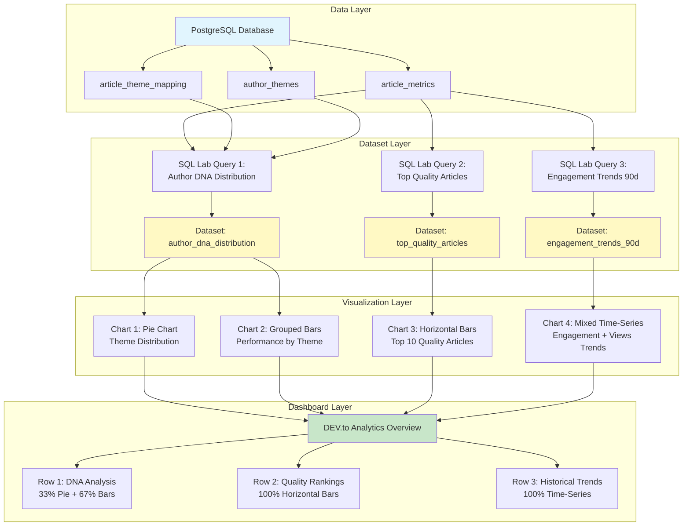

# Apache Superset Dashboard Guide
## DEV.to Analytics Overview Dashboard

Complete step-by-step instructions for creating a production-ready analytics dashboard in Apache Superset.

---

## 📋 Prerequisites

**Access Points:**
- Superset UI: http://dashboard.local or http://localhost:8088
- Credentials: admin / admin
- Database connection: PostgreSQL (already configured as "DEV.to Analytics")

**Dashboard Preview:**
```
┌─────────────────────────────────────────────────────────────┐
│  📊 DEV.to Analytics Overview                               │
├──────────────────┬──────────────────────────────────────────┤
│  🧬 Author DNA   │  📈 DNA Performance                      │
│  Pie Chart       │  Grouped Bar Chart                       │
│  33% width       │  67% width                               │
├──────────────────┴──────────────────────────────────────────┤
│  🏆 Top 10 Quality Articles                                 │
│  Horizontal Bar Chart with Gradient Colors                  │
│  100% width                                                 │
├─────────────────────────────────────────────────────────────┤
│  📉 Engagement Trends - Last 90 Days                        │
│  Mixed Time-Series (Line + Area Chart)                      │
│  100% width                                                 │
└─────────────────────────────────────────────────────────────┘
```

---

## Part 1: Create SQL Datasets (3 Datasets)

### Dataset 1: Author DNA Distribution

**Purpose:** Analyze content themes and their performance metrics.

**Navigation:**
1. Go to **Data → Datasets** (top menu)
2. Click **+ Dataset** (top right)
3. Choose **Database:** "DEV.to Analytics" (or your PostgreSQL connection)
4. Choose **Schema:** public
5. **Do NOT** choose a table - we'll use SQL Lab instead
6. Cancel and go to **SQL → SQL Lab** instead

**Create via SQL Lab:**
1. Go to **SQL → SQL Lab**
2. Select **Database:** DEV.to Analytics
3. Select **Schema:** public
4. Paste this query:

```sql
-- Author DNA Distribution with Performance Metrics
SELECT 
    t.theme_name,
    COUNT(DISTINCT atm.article_id) as article_count,
    ROUND(AVG(subq.max_views)) as avg_views,
    ROUND(AVG(subq.max_reactions)) as avg_reactions,
    ROUND(
        (SUM(subq.max_reactions)::float / NULLIF(SUM(subq.max_views), 0) * 100)::numeric, 
        2
    ) as avg_engagement
FROM article_theme_mapping atm
JOIN author_themes t ON atm.theme_id = t.theme_id
JOIN (
    SELECT 
        article_id, 
        MAX(views) as max_views, 
        MAX(reactions) as max_reactions
    FROM article_metrics
    WHERE published_at IS NOT NULL
    GROUP BY article_id
) subq ON atm.article_id = subq.article_id
GROUP BY t.theme_name
ORDER BY article_count DESC;
```

5. Click **Run** to test
6. Click **Save** → **Save dataset**
7. Name: `author_dna_distribution`
8. Click **Save & Explore**

**Expected Columns:**
- `theme_name` (STRING) - Theme category
- `article_count` (INTEGER) - Number of articles
- `avg_views` (INTEGER) - Average views per theme
- `avg_reactions` (INTEGER) - Average reactions per theme
- `avg_engagement` (FLOAT) - Engagement percentage

---

### Dataset 2: Top Quality Articles

**Purpose:** Identify best-performing articles by quality score.

**SQL Lab Query:**
```sql
-- Top Quality Articles (Latest Snapshot per Article)
WITH latest_snapshots AS (
    SELECT DISTINCT ON (article_id)
        article_id,
        title,
        views,
        reactions,
        comments,
        reading_time_minutes,
        collected_at
    FROM article_metrics
    WHERE published_at IS NOT NULL
    ORDER BY article_id, collected_at DESC
)
SELECT 
    ls.article_id,
    ls.title,
    ls.views,
    ls.reactions,
    ls.comments,
    ls.reading_time_minutes,
    -- Quality Score Formula: (completion × 0.7) + (engagement × 1.5)
    ROUND(
        (LEAST(ls.reading_time_minutes * 60.0 / NULLIF(ls.views, 0) * 100, 100) * 0.7) +
        (LEAST(ls.reactions::float / NULLIF(ls.views, 0) * 100, 20) * 1.5),
        2
    ) as quality_score,
    -- Completion %
    ROUND(
        LEAST(ls.reading_time_minutes * 60.0 / NULLIF(ls.views, 0) * 100, 100),
        2
    ) as completion_percent,
    -- Engagement %
    ROUND(
        ls.reactions::float / NULLIF(ls.views, 0) * 100,
        2
    ) as engagement_percent
FROM latest_snapshots ls
WHERE ls.views > 0
ORDER BY quality_score DESC
LIMIT 50;
```

**Save as:** `top_quality_articles`

**Expected Columns:**
- `article_id` (INTEGER)
- `title` (STRING)
- `views` (INTEGER)
- `reactions` (INTEGER)
- `comments` (INTEGER)
- `reading_time_minutes` (INTEGER)
- `quality_score` (FLOAT) - 0-100 score
- `completion_percent` (FLOAT) - Read completion %
- `engagement_percent` (FLOAT) - Reaction rate %

---

### Dataset 3: Engagement Trends (90 Days)

**Purpose:** Track engagement rate and views over time.

**SQL Lab Query:**
```sql
-- Engagement Trends - Weekly Aggregation (90 days)
WITH weekly_stats AS (
    SELECT 
        DATE_TRUNC('week', collected_at)::date as week,
        article_id,
        MAX(views) as max_views,
        MAX(reactions) as max_reactions
    FROM article_metrics
    WHERE 
        published_at IS NOT NULL
        AND collected_at >= CURRENT_DATE - INTERVAL '90 days'
    GROUP BY 
        DATE_TRUNC('week', collected_at),
        article_id
)
SELECT 
    week,
    COUNT(DISTINCT article_id) as articles_published,
    SUM(max_views) as total_views,
    SUM(max_reactions) as total_reactions,
    ROUND(
        (SUM(max_reactions)::float / NULLIF(SUM(max_views), 0) * 100)::numeric,
        2
    ) as avg_engagement
FROM weekly_stats
GROUP BY week
ORDER BY week ASC;
```

**Save as:** `engagement_trends_90d`

**Expected Columns:**
- `week` (DATE) - Week start date
- `articles_published` (INTEGER)
- `total_views` (INTEGER)
- `total_reactions` (INTEGER)
- `avg_engagement` (FLOAT) - Weekly engagement %

---

## Part 2: Create Charts (4 Charts)

### Chart 1: 🧬 Author DNA Pie Chart

**Step-by-Step:**

1. **Navigate to Charts:**
   - Go to **Charts** (top menu)
   - Click **+ Chart** (top right)

2. **Choose Chart Type:**
   - Select **Pie Chart**
   - Click **Create new chart**

3. **Select Dataset:**
   - Choose: `author_dna_distribution`
   - Click **Create new chart**

4. **Configure Data Tab:**
   - **Dimensions:**
     * Add: `theme_name`
   
   - **Metric:**
     * Click **Simple** → Choose `article_count`
     * Aggregation: `SUM`
   
   - **Sort:**
     * Sort by: `article_count`
     * Sort descending: ✓

5. **Configure Customize Tab:**
   - **Header:**
     * Chart title: `Content Distribution by Theme`
     * Show legend: ✓
   
   - **Pie Chart:**
     * Donut: ✗ (full pie)
     * Show labels: ✓
     * Label type: `key_value_percent`
     * Number format: `,d` (for integers)
   
   - **Color Scheme:**
     * Choose: `supersetColors` or `d3Category10`

6. **Save:**
   - Click **Save** (top right)
   - Chart name: `Author DNA - Pie Chart`
   - Add to dashboard: **Create new dashboard**
   - Dashboard name: `DEV.to Analytics Overview`
   - Click **Save & go to dashboard**

**Expected Result:**
- Pie chart showing theme distribution
- Labels with theme name, count, and percentage
- Legend on right side
- Hover shows exact values

---

### Chart 2: 📈 DNA Performance Bars

**Step-by-Step:**

1. **Create New Chart:**
   - Go to **Charts** → **+ Chart**
   - Chart type: **Bar Chart**
   - Dataset: `author_dna_distribution`

2. **Configure Data Tab:**
   - **X-Axis:**
     * Column: `theme_name`
   
   - **Metrics (Y-Axis):**
     * Metric 1:
       - Click **Simple** → Choose `avg_views`
       - Aggregation: `AVG`
       - Label: "Avg Views"
     
     * Metric 2:
       - Click **Add metric**
       - Choose `avg_engagement`
       - Aggregation: `AVG`
       - Label: "Engagement %"
   
   - **Y-Axis Format:**
     * Y-axis format (views): `,d`
     * Y-axis 2 format (engagement): `.2f`

3. **Configure Customize Tab:**
   - **Header:**
     * Title: `Performance by Theme`
   
   - **Chart Options:**
     * Bar orientation: Vertical
     * Show bar values: ✓
     * Bar stacking: Group (NOT stack)
   
   - **X-Axis:**
     * X-axis label: "Theme"
     * Rotate axis label: 45°
   
   - **Y-Axis:**
     * Y-axis label: "Avg Views"
     * Y-axis 2 label: "Engagement %"
     * Show split Y-axis: ✓
   
   - **Color Scheme:**
     * Choose: `bnbColors` (modern look)

4. **Save:**
   - Chart name: `DNA Performance - Grouped Bars`
   - Add to: `DEV.to Analytics Overview` dashboard
   - Click **Save**

**Expected Result:**
- Grouped bars (2 bars per theme)
- Blue bars for avg_views (left axis)
- Orange bars for avg_engagement (right axis)
- Values displayed on top of bars
- Dual Y-axes with different scales

---

### Chart 3: 🏆 Top 10 Quality Articles (Horizontal Bars)

**Step-by-Step:**

1. **Create Chart:**
   - Chart type: **Bar Chart**
   - Dataset: `top_quality_articles`

2. **Configure Data Tab:**
   - **X-Axis:**
     * Column: `quality_score`
   
   - **Y-Axis (Dimensions):**
     * Column: `title`
   
   - **Metric:**
     * Column: `quality_score`
     * Aggregation: `MAX` (since we want the value itself)
   
   - **Row Limit:**
     * Set to: `10`
   
   - **Sort:**
     * Sort by: `quality_score`
     * Sort descending: ✓

3. **Configure Customize Tab:**
   - **Header:**
     * Title: `Top 10 Articles by Quality Score`
   
   - **Chart Options:**
     * Bar orientation: **Horizontal** ← IMPORTANT
     * Show bar values: ✓
     * Reduce X-axis ticks: ✓
   
   - **X-Axis:**
     * Label: "Quality Score (0-100)"
     * Bounds: [0, 100]
   
   - **Y-Axis:**
     * Label: "Article Title"
     * Truncate Y-axis: ✓
     * Y-axis label length: 50
   
   - **Color Scheme:**
     * Use linear color scheme: ✓
     * Choose: `blue_white_yellow` (gradient)
     * OR create custom with thresholds:
       - 0-40: Red (`#d62728`)
       - 40-60: Yellow (`#ff7f0e`)
       - 60-100: Green (`#2ca02c`)

4. **Advanced Analytics (Optional):**
   - Add reference line at score = 60 (quality threshold)

5. **Save:**
   - Chart name: `Top Quality Articles - Horizontal Bars`
   - Add to: `DEV.to Analytics Overview`

**Expected Result:**
- 10 horizontal bars, longest at top (highest quality)
- Gradient color from green (high) to yellow/red (low)
- Truncated titles to 50 characters
- Quality score values at end of each bar
- Clean, scannable layout

---

### Chart 4: 📉 Engagement Trends (Mixed Time-Series)

**Step-by-Step:**

1. **Create Chart:**
   - Chart type: **Mixed Time-Series** (under "Evolution" category)
   - Dataset: `engagement_trends_90d`

2. **Configure Data Tab:**
   - **Time Column:**
     * Choose: `week`
     * Time grain: `Week`
   
   - **Metrics:**
     * Metric 1 (Line):
       - Column: `avg_engagement`
       - Aggregation: `AVG`
       - Label: "Engagement Rate %"
       - Chart type: `Line`
       - Y-axis: `Primary`
     
     * Metric 2 (Area):
       - Column: `total_views`
       - Aggregation: `SUM`
       - Label: "Total Views"
       - Chart type: `Area`
       - Y-axis: `Secondary`
   
   - **Time Range:**
     * Use: `Last 90 days` or `No filter` (data already filtered)

3. **Configure Customize Tab:**
   - **Header:**
     * Title: `Engagement Rate & Views Trend (90 days)`
   
   - **Chart Options:**
     * Show legend: ✓
     * Legend orientation: Top
     * Show markers: ✓
     * Line interpolation: `linear` or `smooth`
   
   - **X-Axis:**
     * Label: "Week"
     * Show axis line: ✓
   
   - **Y-Axis (Primary - Engagement):**
     * Label: "Engagement Rate %"
     * Format: `.2f`
     * Bounds: Auto or [0, 15]
   
   - **Y-Axis (Secondary - Views):**
     * Label: "Total Views"
     * Format: `,d`
     * Show split Y-axis: ✓
   
   - **Colors:**
     * Engagement Rate: Blue (`#1f77b4`)
     * Total Views: Light blue/gray (`#aec7e8`) with 50% opacity

4. **Area Chart Styling:**
   - **Opacity:** 0.5 for area fill
   - **Line Style:** Solid (1.5px width)
   - **Marker size:** Small (4px)

5. **Save:**
   - Chart name: `Engagement Trends - Mixed Time-Series`
   - Add to: `DEV.to Analytics Overview`

**Expected Result:**
- Dual-axis time-series chart
- Blue line for engagement rate (left axis)
- Light blue filled area for views (right axis)
- Markers on data points
- Smooth transitions between weeks
- Interactive hover showing both metrics

---

## Part 3: Assemble Dashboard

### Step 1: Access Dashboard

1. Go to **Dashboards** (top menu)
2. Find: `DEV.to Analytics Overview`
3. Click to open
4. Click **Edit Dashboard** (top right)

### Step 2: Arrange Layout

**Target Layout Structure:**

```
Row 1 (Height: 400px):
├─ Chart 1: Author DNA Pie (4 columns wide)
└─ Chart 2: DNA Performance Bars (8 columns wide)

Row 2 (Height: 500px):
└─ Chart 3: Top Quality Articles (12 columns wide)

Row 3 (Height: 500px):
└─ Chart 4: Engagement Trends (12 columns wide)
```

**Drag & Drop Instructions:**

1. **Row 1 - DNA Analysis:**
   - Drag **Author DNA - Pie Chart** to top-left
   - Resize: Width = 4 columns (33%)
   - Height: 400px
   
   - Drag **DNA Performance - Grouped Bars** next to pie chart
   - Resize: Width = 8 columns (67%)
   - Height: 400px (same as pie)

2. **Row 2 - Quality Rankings:**
   - Drag **Top Quality Articles** below Row 1
   - Resize: Full width (12 columns = 100%)
   - Height: 500px

3. **Row 3 - Trends:**
   - Drag **Engagement Trends** below Row 2
   - Resize: Full width (12 columns)
   - Height: 500px

### Step 3: Add Dividers & Text

1. **Add Dashboard Title:**
   - Click **Components** tab (left sidebar)
   - Drag **Markdown** to very top
   - Edit content:
   ```markdown
   # 📊 DEV.to Analytics Overview
   
   Real-time insights into content performance, quality metrics, and engagement trends.
   
   **Last Updated:** {{ current_datetime }}
   ```
   - Height: 100px

2. **Add Section Headers:**
   - Before Row 1: Add Markdown
   ```markdown
   ## 🧬 Author DNA Analysis
   Understanding your content themes and their performance
   ```
   
   - Before Row 2: Add Markdown
   ```markdown
   ## 🏆 Quality Rankings
   Top-performing articles by quality score (completion × engagement)
   ```
   
   - Before Row 3: Add Markdown
   ```markdown
   ## 📈 Historical Trends
   Tracking engagement patterns over the last 90 days
   ```

3. **Add Dividers:**
   - Drag **Divider** components between sections
   - Style: Solid line, 1px, gray

### Step 4: Add Filters (Optional)

**Date Range Filter for Trends:**

1. In edit mode, click **Filter** icon (left sidebar)
2. Add **Time Range Filter**
   - Target: `Engagement Trends` chart
   - Column: `week`
   - Default: Last 90 days
   
3. Position filter at top of dashboard (below title)

**Theme Filter for DNA Charts:**

1. Add **Select Filter**
   - Target: Both DNA charts
   - Column: `theme_name`
   - Default: All themes selected

---

## Part 4: Polish & Publish

### Step 1: Dashboard Settings

1. Click **Settings** (gear icon in edit mode)

2. **Properties:**
   - Title: `DEV.to Analytics Overview`
   - Slug: `devto-analytics-overview`
   - Published: ✓ (make visible)
   - Certification: Add certification if official

3. **JSON Metadata (Advanced):**
   ```json
   {
     "color_scheme": "supersetColors",
     "refresh_frequency": 3600,
     "timed_refresh_immune_slices": [],
     "default_filters": {}
   }
   ```

4. **Access Control:**
   - Owners: Your user
   - Roles: Add appropriate roles (Gamma, Alpha)

### Step 2: Visual Polish

**Color Consistency:**
- Pie Chart: Use `supersetColors` (default)
- Bar Charts: Use `bnbColors` (modern)
- Time-Series: Custom blues (consistent branding)

**Typography:**
- All chart titles: 18px, bold
- Axis labels: 12px, gray
- Values: 11px, black
- Dashboard title: 28px, bold

**Spacing:**
- Row gaps: 20px
- Column gaps: 15px
- Section headers: 60px height
- Margins: 15px all sides

### Step 3: Test Interactivity

**Verify Each Chart:**
1. ✓ Hover tooltips show correct values
2. ✓ Click on pie slice highlights related data
3. ✓ Bar charts show exact values on hover
4. ✓ Time-series markers are clickable
5. ✓ Filters apply to correct charts
6. ✓ No console errors (F12 DevTools)

**Test Responsive Design:**
1. Resize browser window
2. Check mobile view (hamburger menu)
3. Verify charts scale properly
4. Text remains readable at all sizes

### Step 4: Save & Exit

1. Click **Save** (top right)
2. Exit edit mode
3. View final dashboard as end-user would see it

---

## Part 5: Verification Checklist

### Data Quality Checks

- [ ] **Author DNA Pie Chart:**
  - [ ] Shows 4 themes (Expertise Tech, Human & Career, Culture & Agile, Free Exploration)
  - [ ] Percentages add up to 100%
  - [ ] Article counts match database totals
  - [ ] Colors are distinct and professional

- [ ] **DNA Performance Bars:**
  - [ ] Shows dual Y-axes (views + engagement)
  - [ ] Bars are grouped, not stacked
  - [ ] Values displayed on bars
  - [ ] Themes ordered by performance

- [ ] **Top Quality Articles:**
  - [ ] Shows exactly 10 articles
  - [ ] Ordered by quality score (descending)
  - [ ] Titles are truncated but readable
  - [ ] Gradient colors reflect score levels
  - [ ] Scores range from 0-100

- [ ] **Engagement Trends:**
  - [ ] Shows 13 weeks of data (~90 days)
  - [ ] Line (engagement %) is smooth
  - [ ] Area (views) is filled with transparency
  - [ ] Both metrics visible on hover
  - [ ] X-axis labels are readable

### Layout & UX Checks

- [ ] Dashboard title is prominent
- [ ] All charts have descriptive titles
- [ ] Section headers guide the narrative
- [ ] Charts are aligned properly
- [ ] No scrolling within individual charts
- [ ] Mobile view is usable
- [ ] Filters work as expected
- [ ] No JavaScript errors

### Performance Checks

- [ ] Dashboard loads in < 5 seconds
- [ ] Charts render without lag
- [ ] Hover interactions are smooth
- [ ] Filters update charts quickly
- [ ] No SQL query timeouts

---

## Part 6: Advanced Customization

### Custom SQL for Better Performance

**Materialized View for Faster Queries:**

```sql
-- Create materialized view for Author DNA (run in SQL Lab)
CREATE MATERIALIZED VIEW mv_author_dna_snapshot AS
SELECT 
    t.theme_name,
    COUNT(DISTINCT atm.article_id) as article_count,
    ROUND(AVG(subq.max_views)) as avg_views,
    ROUND(AVG(subq.max_reactions)) as avg_reactions,
    ROUND(
        (SUM(subq.max_reactions)::float / NULLIF(SUM(subq.max_views), 0) * 100)::numeric, 
        2
    ) as avg_engagement,
    NOW() as snapshot_at
FROM article_theme_mapping atm
JOIN author_themes t ON atm.theme_id = t.theme_id
JOIN (
    SELECT article_id, MAX(views) as max_views, MAX(reactions) as max_reactions
    FROM article_metrics
    WHERE published_at IS NOT NULL
    GROUP BY article_id
) subq ON atm.article_id = subq.article_id
GROUP BY t.theme_name;

-- Refresh daily via cron or Superset scheduled queries
REFRESH MATERIALIZED VIEW mv_author_dna_snapshot;
```

**Update datasets to use materialized view instead of live queries for better performance.**

### Add Calculated Metrics

**Virtual Calculated Column in Dataset:**

1. Go to **Data → Datasets** → `top_quality_articles`
2. Click **Edit** → **Columns** tab
3. Add virtual column:
   - Column name: `quality_tier`
   - SQL expression:
   ```sql
   CASE 
     WHEN quality_score >= 70 THEN 'Excellent'
     WHEN quality_score >= 50 THEN 'Good'
     WHEN quality_score >= 30 THEN 'Fair'
     ELSE 'Needs Improvement'
   END
   ```
4. Save and use in charts for categorical filtering

### Add Alerts (Superset Enterprise)

**Set up alerts for quality thresholds:**
- Alert when avg quality score drops below 50
- Alert when engagement rate falls below 5%
- Weekly summary reports via email

---

## Troubleshooting

### Chart Not Loading

**Symptoms:** Spinner stays indefinitely, no data shown

**Solutions:**
1. Check SQL query in SQL Lab (test independently)
2. Verify dataset has permissions (Owners, Roles)
3. Check database connection is active
4. Review Superset logs: `docker logs devto_superset`
5. Clear cache: Settings → Clear cache

### Wrong Colors in Charts

**Symptoms:** Colors don't match specification

**Solutions:**
1. Edit chart → Customize tab → Color Scheme
2. For custom colors, use "Custom color scheme" option
3. Override individual series colors in JSON metadata
4. Ensure color scheme is available in Superset config

### Filters Not Working

**Symptoms:** Filter changes don't affect charts

**Solutions:**
1. Verify filter targets correct charts (Edit Dashboard → Filter settings)
2. Check column names match between dataset and filter
3. Ensure charts use the filtered column
4. Refresh dashboard after filter changes

### Slow Dashboard Performance

**Symptoms:** Takes >10 seconds to load

**Solutions:**
1. Create materialized views for complex queries
2. Add indexes on filtered columns
3. Reduce row limits in charts (e.g., Top 10 instead of Top 50)
4. Enable Superset caching (1 hour TTL)
5. Use database query cache (PostgreSQL)

### Mobile View Broken

**Symptoms:** Charts overlap or are cut off on mobile

**Solutions:**
1. In edit mode, test responsive breakpoints
2. Set minimum heights for charts
3. Use collapsible sections for mobile
4. Consider creating separate mobile dashboard

---

## Export & Share

### Export Dashboard as PDF

1. Open dashboard
2. Click **...** (more options) → Download
3. Choose format: PDF (requires Selenium in Superset)

### Share Dashboard Link

**Public Link (if enabled):**
```
http://dashboard.local/superset/dashboard/devto-analytics-overview/
```

**Embed in iframe:**
```html
<iframe 
  src="http://dashboard.local/superset/dashboard/devto-analytics-overview/?standalone=true"
  width="100%" 
  height="800px"
  frameborder="0">
</iframe>
```

### Schedule Email Reports

1. Dashboard → **...** → Schedule email delivery
2. Set recipients, frequency (daily/weekly)
3. Attach PDF or send link
4. Requires Celery workers + SMTP config

---

## Next Steps

### Recommended Enhancements

1. **Add More Charts:**
   - Comment sentiment distribution (pie chart)
   - Reading completion funnel (sankey diagram)
   - Tag word cloud (requires plugin)
   - Geographic reader distribution (map chart)

2. **Create Drill-Down Dashboards:**
   - Click on theme → detailed theme analysis dashboard
   - Click on article → article performance deep-dive

3. **Implement Real-Time Updates:**
   - Use Websockets for live data (Superset Enterprise)
   - Set auto-refresh every 5 minutes

4. **Add Predictive Analytics:**
   - ML model predictions for article success
   - Forecasting next week's engagement

5. **Custom Plugins:**
   - Develop custom visualization types
   - Add domain-specific chart components

---

## Support Resources

**Official Documentation:**
- Superset Docs: https://superset.apache.org/docs/intro
- Chart Gallery: https://superset.apache.org/docs/gallery

**Community:**
- Slack: https://apache-superset.slack.com
- GitHub Issues: https://github.com/apache/superset/issues

**Your Setup:**
- Database: `postgresql://localhost:5432/devto_analytics`
- Superset: http://dashboard.local
- API Documentation: http://analytics.local/docs

---

## Summary

**Time to Complete:** ~45-60 minutes

**What You Built:**
- ✅ 3 optimized SQL datasets
- ✅ 4 professional charts (Pie, Bar, Horizontal Bar, Time-Series)
- ✅ 1 complete dashboard with sections and filters
- ✅ Publication-ready analytics platform

**Skills Gained:**
- SQL query optimization for visualization
- Chart type selection and configuration
- Dashboard layout and UX design
- Superset best practices

**Your dashboard is now ready to provide actionable insights into your DEV.to content performance!** 🎉

---

*Generated with GitHub Copilot CLI - DEV.to Analytics Platform*
*Last Updated: 2026-01-27*

---

## Visual Reference: Dashboard Flow



## Color Palette Reference

**Chart Colors (Hex Codes):**

```
Themes:
- Expertise Tech:    #1f77b4 (Blue)
- Human & Career:    #ff7f0e (Orange)
- Culture & Agile:   #2ca02c (Green)
- Free Exploration:  #9467bd (Purple)

Quality Scores:
- Excellent (70+):   #2ca02c (Green)
- Good (50-69):      #ff7f0e (Orange)
- Fair (30-49):      #ffbb00 (Yellow)
- Poor (<30):        #d62728 (Red)

Time-Series:
- Engagement Line:   #1f77b4 (Blue, 100% opacity)
- Views Area:        #aec7e8 (Light Blue, 50% opacity)
- Grid Lines:        #e0e0e0 (Light Gray)

UI Elements:
- Background:        #ffffff (White)
- Text Primary:      #212121 (Dark Gray)
- Text Secondary:    #757575 (Gray)
- Dividers:          #e0e0e0 (Light Gray)
```

## Quick Copy-Paste Snippets

**For Custom Color Scheme in Superset:**

```json
{
  "name": "DEV.to Analytics Theme",
  "colors": [
    "#1f77b4",
    "#ff7f0e", 
    "#2ca02c",
    "#9467bd",
    "#8c564b",
    "#e377c2",
    "#7f7f7f",
    "#bcbd22",
    "#17becf"
  ]
}
```

**For Chart JSON Metadata (Advanced):**

```json
{
  "color_scheme": "supersetColors",
  "label_colors": {
    "Expertise Tech": "#1f77b4",
    "Human & Career": "#ff7f0e",
    "Culture & Agile": "#2ca02c",
    "Free Exploration": "#9467bd"
  }
}
```

---

## Appendix: SQL Query Performance Tips

**Index Recommendations:**

```sql
-- Speed up Author DNA queries
CREATE INDEX idx_article_metrics_published 
  ON article_metrics(published_at) 
  WHERE published_at IS NOT NULL;

CREATE INDEX idx_article_theme_mapping_article 
  ON article_theme_mapping(article_id);

-- Speed up time-series queries
CREATE INDEX idx_article_metrics_collected_at 
  ON article_metrics(collected_at DESC);

-- Speed up quality score calculations
CREATE INDEX idx_article_metrics_views_reactions 
  ON article_metrics(article_id, views, reactions) 
  WHERE published_at IS NOT NULL;
```

**Query Optimization Tips:**

1. **Use EXPLAIN ANALYZE** to check query plans
2. **Avoid SELECT *** - specify only needed columns
3. **Use CTEs** for complex queries (better readability)
4. **Add WHERE clauses** to filter early (published_at IS NOT NULL)
5. **Use DISTINCT ON** instead of GROUP BY when possible
6. **Materialize** frequently used aggregations

---

**🎉 Your comprehensive Superset dashboard guide is complete!**

Follow the step-by-step instructions to build a professional analytics dashboard in 45-60 minutes.
